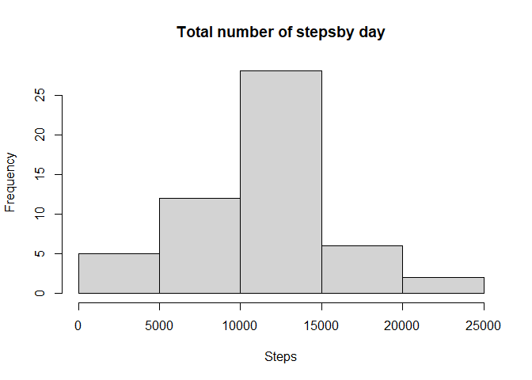
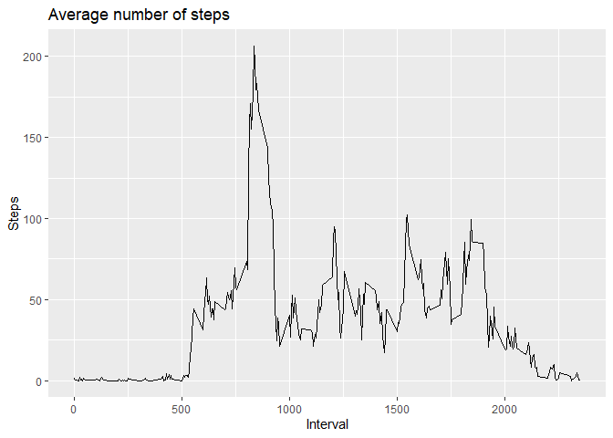

## Loading and preprocessing the data

```r
        library(dplyr)
```

```
## 
## Attaching package: 'dplyr'
```

```
## The following objects are masked from 'package:stats':
## 
##     filter, lag
```

```
## The following objects are masked from 'package:base':
## 
##     intersect, setdiff, setequal, union
```

```r
        library(ggplot2)
        library(lubridate)
```

```
## 
## Attaching package: 'lubridate'
```

```
## The following objects are masked from 'package:base':
## 
##     date, intersect, setdiff, union
```

```r
        if (!file.exists('activity.csv')) {
                unzip(zipfile = "activity.zip")
        }
        
        dataSet <- read.csv("activity.csv", header = TRUE, na.strings = "NA")
        dim(dataSet)
```

```
## [1] 17568     3
```

```r
        head(dataSet)
```

```
##   steps       date interval
## 1    NA 2012-10-01        0
## 2    NA 2012-10-01        5
## 3    NA 2012-10-01       10
## 4    NA 2012-10-01       15
## 5    NA 2012-10-01       20
## 6    NA 2012-10-01       25
```

```r
        compCases <- complete.cases(dataSet)
        dataSetCompleteCases <- dataSet[compCases,]
        #View(dataSetCompleteCases)
```

## What is mean total number of steps taken per day?

```r
        totalStepsByDay <- aggregate(steps ~ date, FUN = sum, data = dataSetCompleteCases)
        print(totalStepsByDay)
```

```
##          date steps
## 1  2012-10-02   126
## 2  2012-10-03 11352
## 3  2012-10-04 12116
## 4  2012-10-05 13294
## 5  2012-10-06 15420
## 6  2012-10-07 11015
## 7  2012-10-09 12811
## 8  2012-10-10  9900
## 9  2012-10-11 10304
## 10 2012-10-12 17382
## 11 2012-10-13 12426
## 12 2012-10-14 15098
## 13 2012-10-15 10139
## 14 2012-10-16 15084
## 15 2012-10-17 13452
## 16 2012-10-18 10056
## 17 2012-10-19 11829
## 18 2012-10-20 10395
## 19 2012-10-21  8821
## 20 2012-10-22 13460
## 21 2012-10-23  8918
## 22 2012-10-24  8355
## 23 2012-10-25  2492
## 24 2012-10-26  6778
## 25 2012-10-27 10119
## 26 2012-10-28 11458
## 27 2012-10-29  5018
## 28 2012-10-30  9819
## 29 2012-10-31 15414
## 30 2012-11-02 10600
## 31 2012-11-03 10571
## 32 2012-11-05 10439
## 33 2012-11-06  8334
## 34 2012-11-07 12883
## 35 2012-11-08  3219
## 36 2012-11-11 12608
## 37 2012-11-12 10765
## 38 2012-11-13  7336
## 39 2012-11-15    41
## 40 2012-11-16  5441
## 41 2012-11-17 14339
## 42 2012-11-18 15110
## 43 2012-11-19  8841
## 44 2012-11-20  4472
## 45 2012-11-21 12787
## 46 2012-11-22 20427
## 47 2012-11-23 21194
## 48 2012-11-24 14478
## 49 2012-11-25 11834
## 50 2012-11-26 11162
## 51 2012-11-27 13646
## 52 2012-11-28 10183
## 53 2012-11-29  7047
```

```r
        hist(totalStepsByDay$steps, main = "Total number of stepsby day", xlab = "Steps")
```

<!-- -->

## What is the average daily activity pattern?

```r
        timeSeries <- aggregate(steps ~ interval, FUN = mean, data = dataSetCompleteCases)
        g <- ggplot(timeSeries, aes(x = interval, y = steps))
        g <- g + geom_line() 
        g <- g + labs(y = "Steps")
        g <- g + labs(x = "Interval")
        g <- g + labs(title = "Average number of steps")
        g
```

<!-- -->

```r
        filter(timeSeries, steps == max(steps))
```

```
##   interval    steps
## 1      835 206.1698
```

## Imputing missing values

```r
        sum(is.na(as.character(dataSet$steps)))
```

```
## [1] 2304
```

```r
        sum(is.na(as.character(dataSet$date)))
```

```
## [1] 0
```

```r
        sum(is.na(as.character(dataSet$interval)))
```

```
## [1] 0
```

```r
        incompCases <- complete.cases(dataSet)
        dataSetIncompleteCases <- dataSet[!incompCases,]
        totalStepsByDayImpute <- aggregate(steps ~ interval, FUN = mean, data = dataSetCompleteCases)
        
        for(i in 1:nrow(dataSet)){
                if(is.na(dataSet$steps[i])){
                        valueAux <- filter(totalStepsByDayImpute, totalStepsByDayImpute$interval == dataSet$interval[i])
                        dataSet$steps[i] <- valueAux$steps
                }
        }
        
        imputedDataset <- dataSet[!incompCases,]
        totalStepsByDayImputed <- aggregate(steps ~ date, FUN = sum, data = imputedDataset)
        hist(totalStepsByDay$steps, main = "Total number of steps by day Imputed", xlab = "Steps")
```

<!-- -->

```r
        totalStepsByDayImputed
```

```
##         date    steps
## 1 2012-10-01 10766.19
## 2 2012-10-08 10766.19
## 3 2012-11-01 10766.19
## 4 2012-11-04 10766.19
## 5 2012-11-09 10766.19
## 6 2012-11-10 10766.19
## 7 2012-11-14 10766.19
## 8 2012-11-30 10766.19
```

## Are there differences in activity patterns between weekdays and weekends?

```r
        timeSeriesWeek <- mutate(dataSetCompleteCases, day = ifelse(wday(date) %in% c(2,3,4,5,6) ,"Weekday","Weekend"))
        
        timeSeriesWD <- aggregate(steps ~ interval+day, FUN = mean, data = timeSeriesWeek)
        
        g <- ggplot(timeSeriesWD, aes(x = interval, y = steps))
        g <- g + geom_line() 
        g <- g + labs(y = "Steps")
        g <- g + labs(x = "Interval")
        g <- g + facet_grid(day ~ .)
        g
```

<!-- -->


